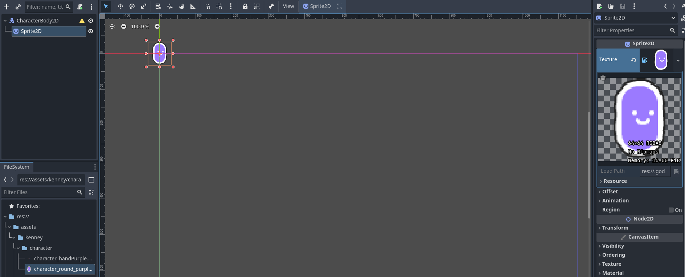
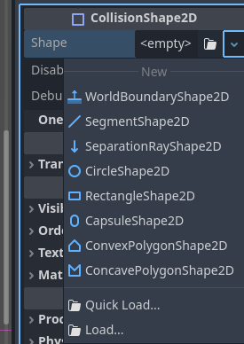
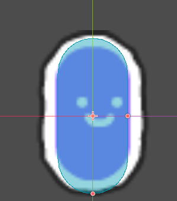
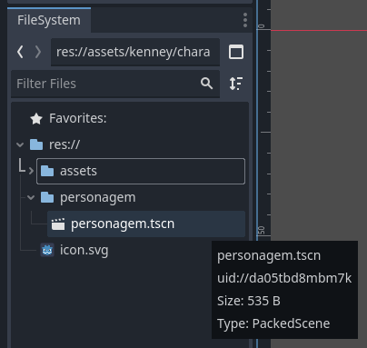
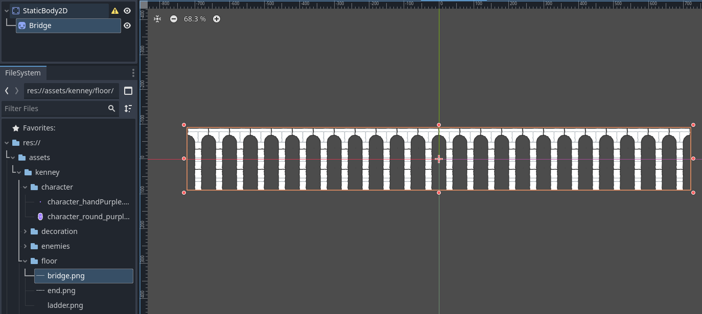
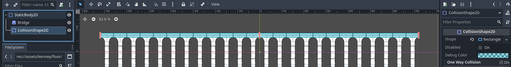

# Godot
- Isso aqui é um resumo do video de `findemor` [LINK](https://www.youtube.com/watch?v=-_LiMyZGoXw)
- Assets gratis [LINK](https://kenney.nl/assets)

## Interface
O godot tem tres areas:
1. O scene (izquerda): Tem a jerarqui da scena e o systemfile
2. O workspace (centro):  para editar e tmbm tem accesso ao output do console e música.
3. O inspector (direita):  com as propriedades do que vc selecionou

Para deixar o godot com a conf de fabrica: `ToolBar > Editor > Editor Layout > Default`

## Scenes
- Todos os jogos começam criando uma `scene`.
- As `scenes` podem conter um ou varios `nodes`, e dependendo do que vc queira fazer vai utilizar algum tipo específico de `node`
  - Existem nodes:
    - `2D`: são azuis
    - `3D`: são vermelhos
    - `control`: são verdes
    - `multiuse`: são gris
  - os `nodes` são os blocos contrutivos básicos de godot (que nem uma  peça do lego).
    - Num lego de carro (jogo), varios tijolinhos differentes (`nodes`) formariam uma porta (`scena`). E pode ser duplicado para ter duas portas.
  - Cada `node` tem tipo, nome e propriedades únicas e pode-se comunicar com outros `nodes`.
  - Então a organização em godot é uma árvore Jogo > `scenes` > `scenes` > `nodes`.

- Como a organização tem forma de árvore, toda `scene` deve começar por um `node` raiz.

### Personagem principal
- Para o personagem principal se começa por um `CharacterBody2D`.
- Para adicionar um sprite `RightClick in CharacterBody2D > Add Child Node > Sprite 2D`
  - Para carregar assets no godot: selecciona a pasta onde estão criados e arrasta na pasta `res://` do filesystem.
  - Seleciona o nodo `Sprite 2D`, e arrasta a o sprite do filesystem ate o campo `Texture` no inspector.

- Agora para adicionar o collider `RightClick in CharacterBody2D > Add Child Node > CollisionShape2D`. Ao selecionar ele podemos escolher o shape :  

- No caso do exemplo será `capsule` e podemos customizar o tamanho:  

- Pronto! Isso daqui é uma `scene` composta de 3 `nodes`.
- Para salvar `Toolbar > Scene > Save Scene >` seleciona um nome e `Save`.
  - É recomendável criar uma pasta para salvar todas as escenas assim fica mais organizado. Ao criar por exemplo a pasta `personagem` e salvar dentro a `scene` `personagem.tscn`. Podemos ver essa organização no `filesystem`. 

### Fisicas

- Os tipos básicos de `node`:
  1. `CharacterBody2D`: São controlados diretamente (por el usuário). O movimento deles afetam outros objetos. Aplicação: personagens.
  2. `RigidBody`: Para simular objetos, se movem quando se aplicam forças neles (gravidade, impulsos) e o motor calcula o movimento. O movimento deles afetam outros objetos. Aplicação: caixas, obstáculos
  3. `StaticBody`: No se movem devido a forças externas, se ele se move nao afeta outros objetos. Aplicaçâo: Chao, parede, superficies em movimento

### Chao
- Criamos uma nova scena, o `node` raiz é um `StaticBody2D`
- Ao arrastar uma imagem no `workspace` da `scene` se criara automaticament um `node` `sprite2D`

- Adicionamos um `CollisionShape2D`, selecionamos o shape `Rectangle` e ajustamos o tamanho ao chao (apenas a parte onde o personagem vai andar).

